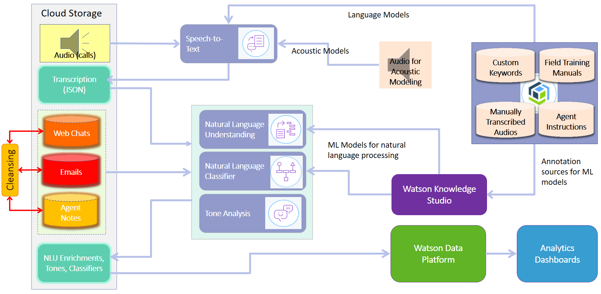

# Reference Architecture Repository for Watson Extends

Watson Extend is the foundational layer of Watson. Watson Extend services provide low-level feature extraction capabilities that take broad or unstructured data and create meaningful, actionable, and valuable information for users. Watson Extend services are offered as Application Programming Interfaces (APIs) on Watson Developer Cloud and are also used to extend other use cases.

This example solution in this repository is about creating cognitive call center by bringing the power of cognitive computing and analytics to understand customer problems better. The system context for the current solution is shown below.

